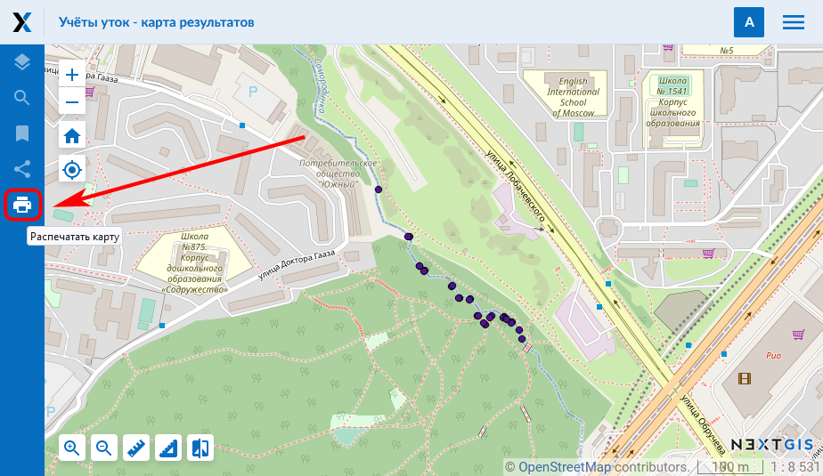
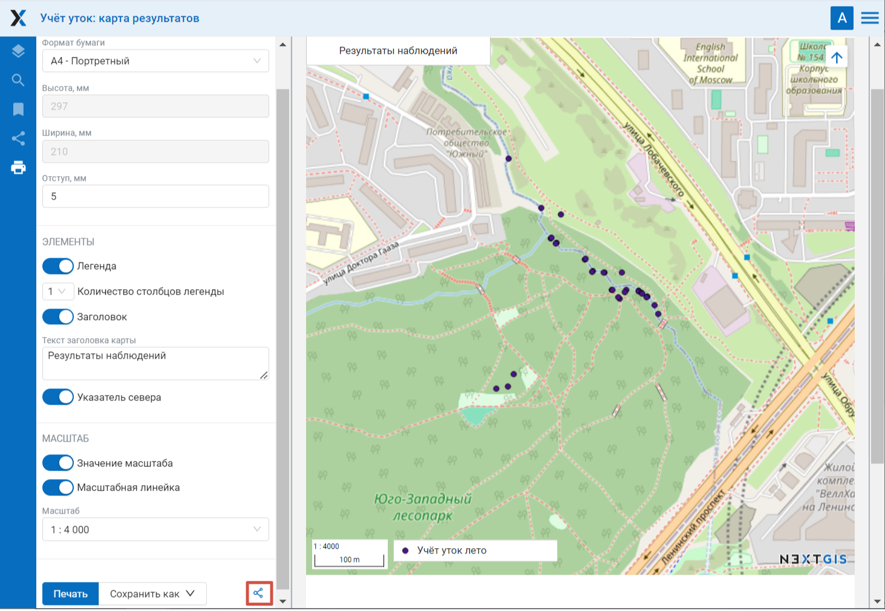
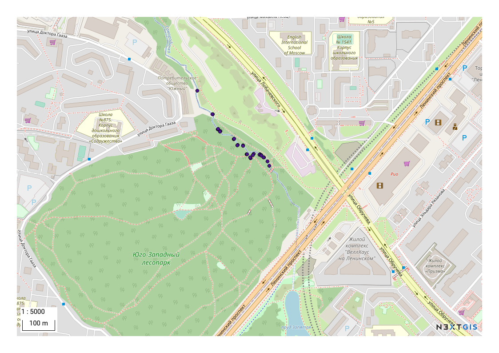

.. _ngcom_webmap_print:

Как распечатать веб-карту
=========================

:ref:`Веб ГИС <ngcom_description>` позволяет распечать Веб-карту или сохранить ее как рисунок. Для того, тобы сделать это:

1. Перейдите в окно свойств созданной Веб-карты из соответствующей :ref:`Группы ресурсов <ngcom_resources_group>`;
2. Выберите :menuselection:`Веб-карта --> Открыть` на правой панели :ref:`веб-интерфейса <ngw_admin_interface>` Веб ГИС;
3. В открывшемся веб-клиенте, через который можно просматривать и редактировать геоданные на веб-карте, нажмите кнопку "Распечатать карту" (см. :numref:`ngweb_webmap_client_print`).
 

   
   Кнопка "Распечатать карту".
 
В открывшемся окне можно определить область карты, которую требуется распечатать, и задать параметры печати:

* Формат бумаги (А4, А3 или пользовательский);
* Отступ;
* Масштаб (можно выбрать значения из списка или навести курсор на карту и настроить нужное колесиком мыши);

Элементы, которые можно добавить на карту:

* Легенда (включает видимые слои, имеющие легенду в развернутом состоянии в развернутых группах, это настраивается на вкладке слоев); 
* Заголовок (можно редактировать, по умолчанию - название веб-карты)
* Указатель севера;
* Значение масштаба;
* Масштабная линейка.

Размеры и положение легенды, заголовка и самой карты можно изменять.

   
   Параметры печати. Красным выделена кнопка "Скопировать ссылку на карту для печати"
   
После того, как указаны все параметры печати, необходимо нажать кнопку "Печать". 

Также можно поделиться подготовленной для печати картой со всеми параметрами, для этого нажмите на значок |button_share|. Ссылка будет скопирована в буфер обмена. Перейдя по ней, можно сразу напечатать карту в нужном виде.

Для того, тобы сохранить карту как рисунок, следует нажать на кнопку "Сохранить как" и в выпадающем списке выбрать формат: JPEG, PNG, TIFF или PDF. После этого автоматически начнется скачивание карты.

   
   Пример карты, сохраненной как рисунок
