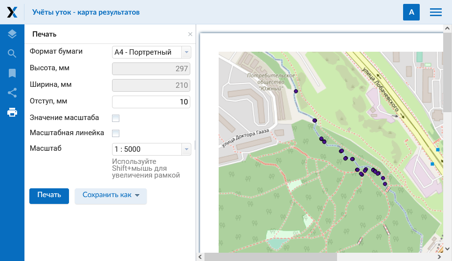

.. _ngcom_webmap_print:

Как распечатать веб-карту
=========================

:ref:`Веб ГИС <ngcom_description>` позволяет распечать Веб-карту или сохранить ее как рисунок. Для того, тобы сделать это:

1. Перейдите в окно свойств созданной Веб-карты из соответствующей :ref:`Группы ресурсов <ngcom_resources_group>`;
2. Выберите :menuselection:`Веб-карта --> Открыть` на правой панели :ref:`веб-интерфейса <ngw_admin_interface>` Веб ГИС;
3. В открывшемся веб-клиенте, через который можно просматривать и редактировать геоданные на веб-карте, нажмите кнопку "Распечатать карту" (см. :numref:`ngweb_webmap_client_print`).
 
.. figure:: _static/webmap_client_print_ru.png
   :name: ngweb_webmap_client_print
   :align: center
   :width: 20cm
   
   Кнопка "Распечатать карту".
 
В открывшемся окне можно определить область карты, которую требуется распечатать, и задать параметры печати:

* Формат бумаги
* Отступ
* Масштаб

Также можно указать, нужно ли выводить на печать значение масштаба и масштабную линейку.

   
   Параметры печати
   
После того, как указаны все параметры печати, необходимо нажать кнопку "Печать". 

Для того, тобы сохранить карту как рисунок, следует нажать на кнопку "Сохранить как" и в выпадающем списке выбрать формат: JPEG или PNG. После этого автоматически начнется скачивание карты.

.. figure:: _static/saved_map_ru.png
   :name: saved_map_pic
   :align: center
   :width: 20cm 
   
   Пример карты, сохраненной как рисунок
