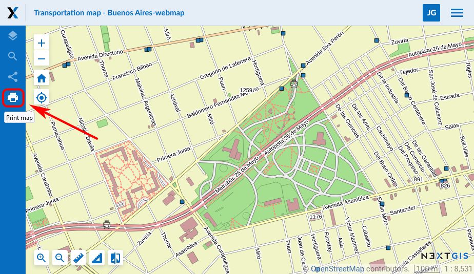
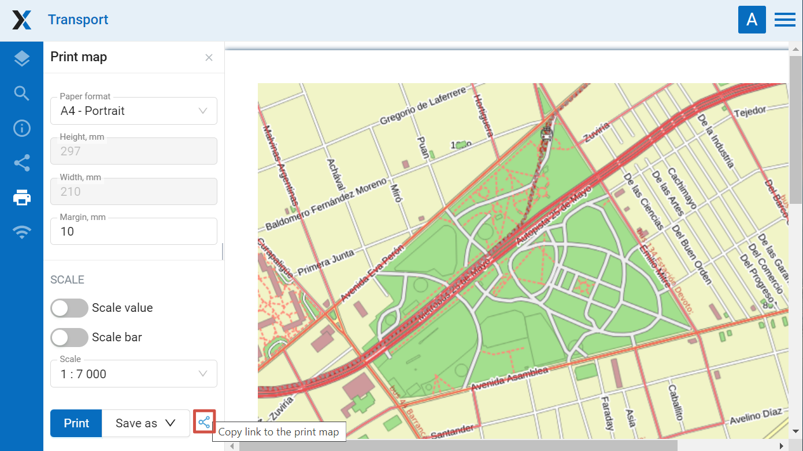
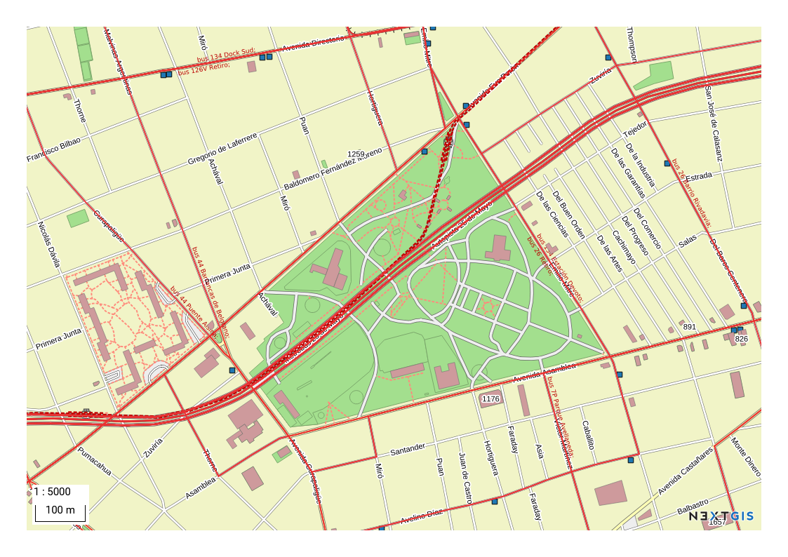

.. _ngcom_webmap_print:

How to print a Web Map
=========================

:ref:`Web GIS <ngcom_description>` allows to print a Web Map or save it as a picture. To do it: 

1. Go to the Properties window of Web Map from the relevant Resource group;
2. Select Web Map ‣ Display on the right side of Web GIS admin console;
3. In the opened web client, which allows to view and edit geodata, press the "Print map" button (see :numref:`ngweb_webmap_client_print`).
 

   
   "Print map" button
 
In the opened window you can select the area you would like to print and set up printing parameters:

* Paper format
* Margins
* Scale

You can also include scale value and scale bar to the printed map.

   
   Printing parameters
   
After you set all parameters press **Print**. 

You can also share the map prepared for printing with all the parameters. Click on the |button_share| symbol to copy the link. Upon opening this link you'll get the same setup and print the map as needed.

.. |button_share| image:: _static/button_share.png

To save a map as a picture press **Save as** and choose a format from the list: JPEG, PNG, TIFF or PDF. Then uploading will begin automatically.

   
   Example of a Web Map saved as a PNG image
