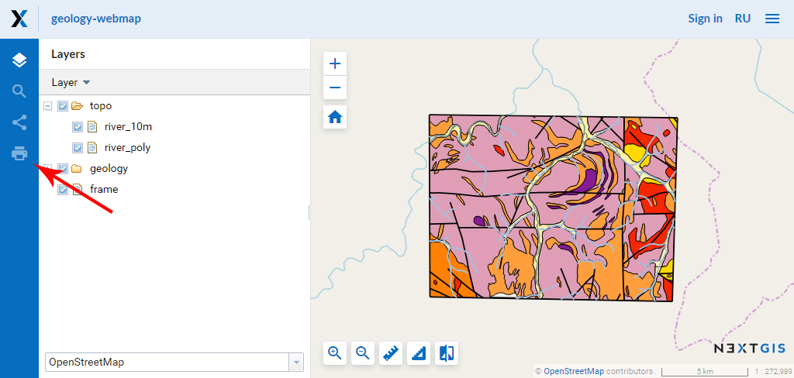
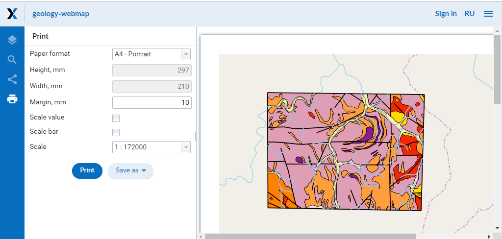

.. _ngcom_webmap_print:

How to print a Web map
=========================

:ref:`Web GIS <ngcom_description>` allows to print a Web map or save it as a picture. To do it: 

1. Go to the Properties window of Web map from the relevant Resource group;
2. Select Web map ‣ Display on the right side of Web GIS admin console. 
Web map will open in a web client which allows to view and edit geodata.
In opened Web map client you can look at a Web map and edit geodata on it.
3. Press "Print map" button (see :numref:`ngweb_webmap_client_print`).
 

   
   "Print map" button.
 
In opened window you can select a map's region you would like to print and set printing parameters:

* Paper format
* Margin
* Scale

You can also tick for scale value and scale bar displaying on a printing map.

   
   Printing parameters.
   
After you set all parameters press "Print" button. To save a map as a picture press "Save as" button and in a list choose a format: JPEG or PNG. Then uploading will begin automatically.     
