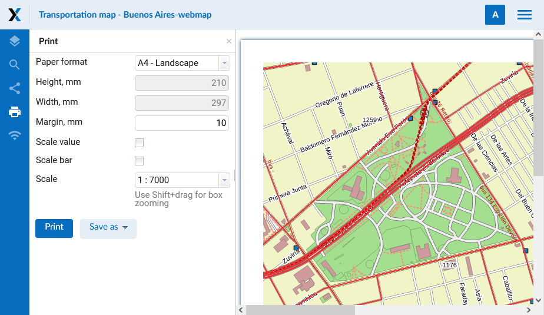

.. _ngcom_webmap_print:

How to print a Web Map
=========================

:ref:`Web GIS <ngcom_description>` allows to print a Web Map or save it as a picture. To do it: 

1. Go to the Properties window of Web Map from the relevant Resource group;
2. Select Web Map ‣ Display on the right side of Web GIS admin console;
3. In the opened web client, which allows to view and edit geodata, press the "Print map" button (see :numref:`ngweb_webmap_client_print`).
 
.. figure:: _static/webmap_client_print_eng_2.png
   :name: ngweb_webmap_client_print
   :align: center
   :width: 20cm
   
   "Print map" button
 
In the opened window you can select the region you would like to print and set printing parameters:

* Paper format
* Margin
* Scale

You can also tick for scale value and scale bar to be displayed on the printed map.

   
   Printing parameters
   
After you set all parameters press "Print" button. 

To save a map as a picture press "Save as" button and in a list choose a format: JPEG or PNG. Then uploading will begin automatically.

.. figure:: _static/saved_map_en.png
   :name: saved_map_pic
   :align: center
   :width: 20cm 
   
   Example of a Web Map saved as a PNG image
