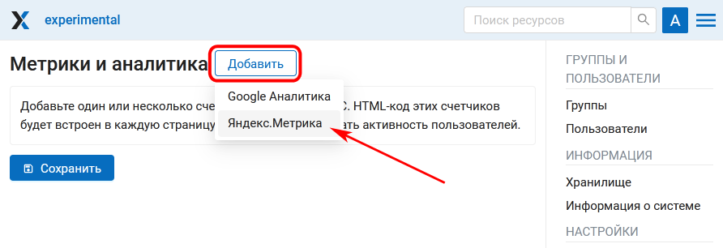

.. _ngcom_ya_metr:

Как подключить свою Веб ГИС к Яндекс.Метрике
=============================================

.. note:: 
        Функционал доступен только на плане `Premium <https://nextgis.ru/pricing-base/>`_

Мониторить статистику посещений вашей Веб ГИС можно, подключив её к `Яндекс.Метрике <https://metrika.yandex.ru/>`_.

Для этого добавьте новый счетчик со следующими настройками:

.. figure:: _static/cr_metr.png
   :name: cr_metr
   :align: center
   :width: 35cm

   Создание нового счетчика

* Добавьте название счетчика и URL вашей Веб ГИС.

.. figure:: _static/metr_sett_1.png
   :name: metr_sett_1
   :align: center
   :width: 25cm

   Название счетчика и URL Веб ГИС

* На следующем шаге включите вебвизор и код счетчика в одну строку

.. figure:: _static/metr_sett_2.png
   :name: metr_sett_2
   :align: center
   :width: 18cm

   Настройки и код счетчика
   
* Зайдите в свою Веб ГИС, в Панели управления отройте раздел **Метрики и аналитика**. Нажмите **Добавить** и выберите во всплывающем меню Яндекс Метрика.

.. figure:: _static/metr_add_ru.png
   :name: metr_add_pic
   :align: center
   :width: 20cm

   Добавление Яндекс Метрики в разделе "Метрики и аналитика"

* Вставьте номер счетчика в соответствующее поле и нажмите **Сохранить**.

   Добавление счетчика
