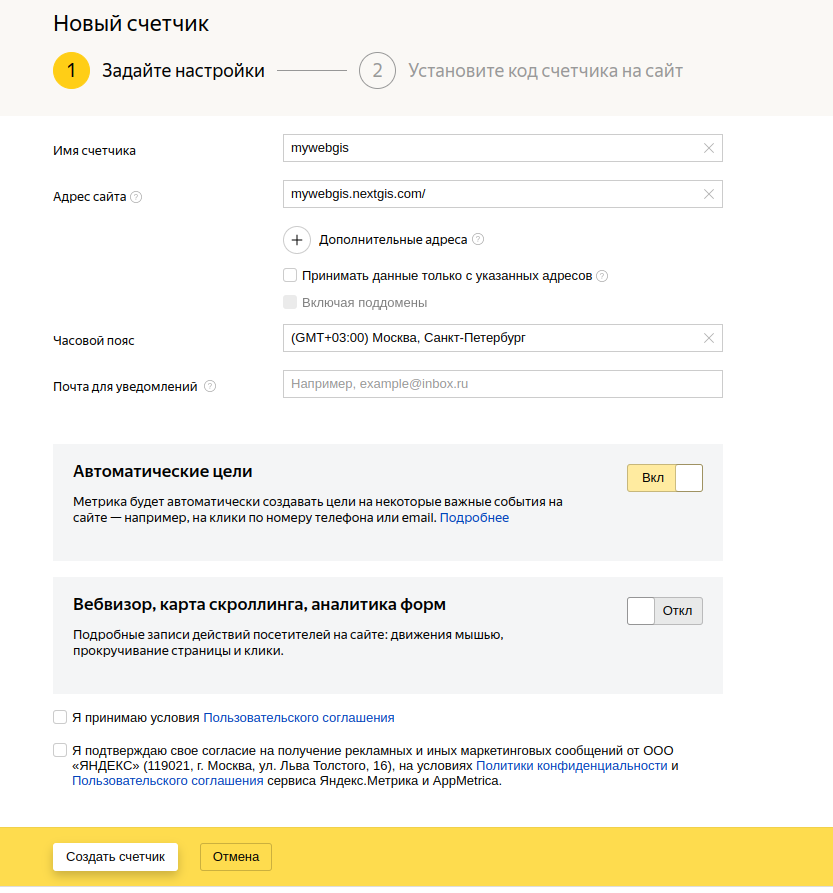
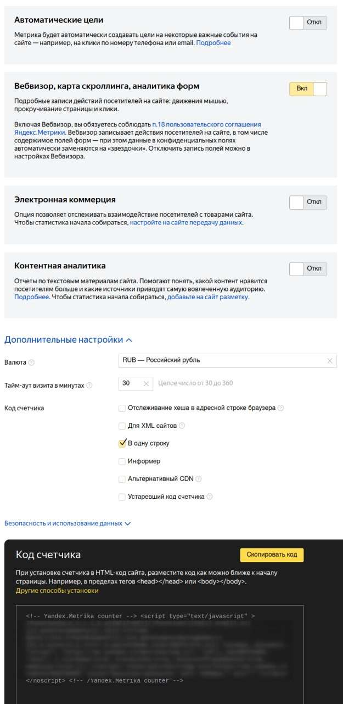

.. _ngcom_ya_metr:

Как подключить свою Веб ГИС к Яндекс.Метрике
=============================================

.. note:: 
        Функционал доступен только на плане `Premium <https://nextgis.ru/pricing-base/>`_

Мониторить статистику посещений вашей Веб ГИС можно, подключив её к `Яндекс.Метрике <https://metrika.yandex.ru/>`_.

Для этого добавьте новый счетчик со следующими настройками:

   Создание нового счетчика

* Добавьте название счетчика и URL вашей Веб ГИС.

   Название счетчика и URL Веб ГИС

* На следующем шаге включите вебвизор и код счетчика в одну строку

   Настройки и код счетчика
   
* Код счетчика, находящийся в нижней части страницы, скопируйте и отправьте нам на support@nextgis.com с названием вашей Веб ГИС. Мы подключим для вас метрику.
