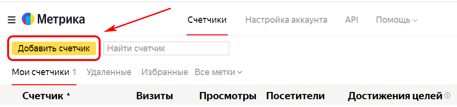
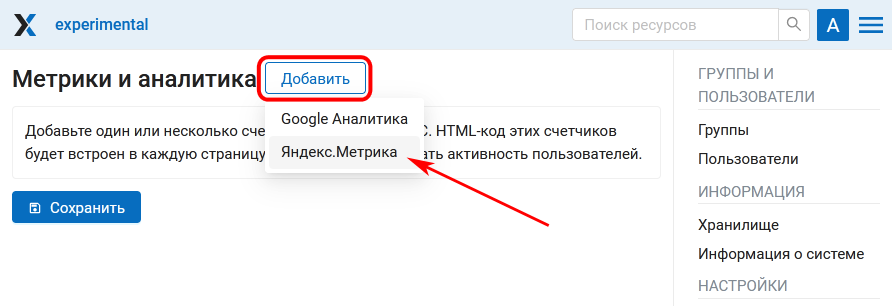
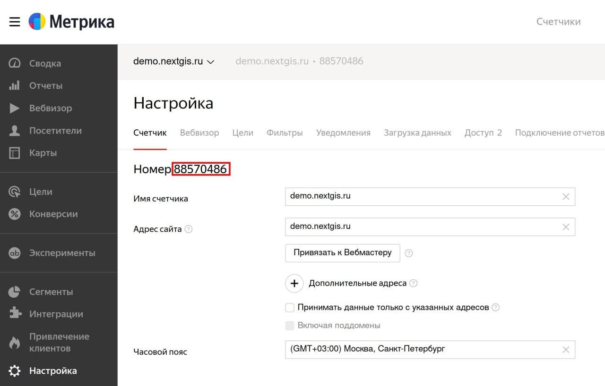
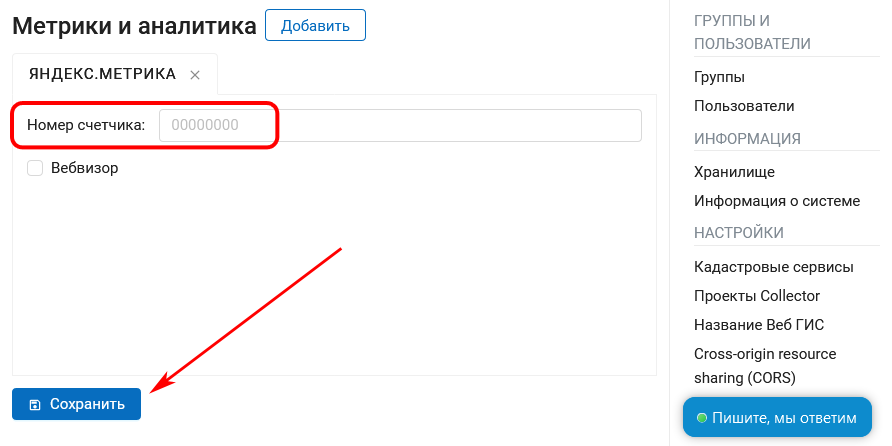

.. _ngcom_ya_metr:

Как подключить свою Веб ГИС к Яндекс.Метрике
=============================================

.. note:: 
        Функционал доступен только на плане `Premium <https://nextgis.ru/pricing-base/>`_

Мониторить статистику посещений вашей Веб ГИС можно, подключив её к `Яндекс.Метрике <https://metrika.yandex.ru/>`_.

Войдите в свой аккаунт на Яндекс и выберите **Добавить счетчик**:

   Создание нового счетчика

* Впишите название счетчика и URL вашей Веб ГИС и нажмите **Создать**.

.. figure:: _static/metr_sett_1.png
   :name: metr_sett_1
   :align: center
   :width: 20cm

   Название счетчика и URL Веб ГИС
   
* Зайдите в свою Веб ГИС, в Панели управления отройте раздел **Метрики и аналитика**. Нажмите **Добавить** и выберите во всплывающем меню "Яндекс Метрика".

   Добавление Яндекс Метрики в разделе "Метрики и аналитика"

* Вставьте номер счетчика в соответствующее поле.

   Номер счетчика в настройках Яндекс Метрики

   Добавление счетчика

* Для завершения операции нажмите **Сохранить**.
