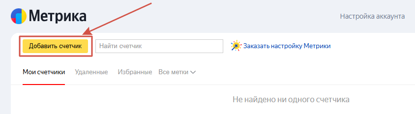
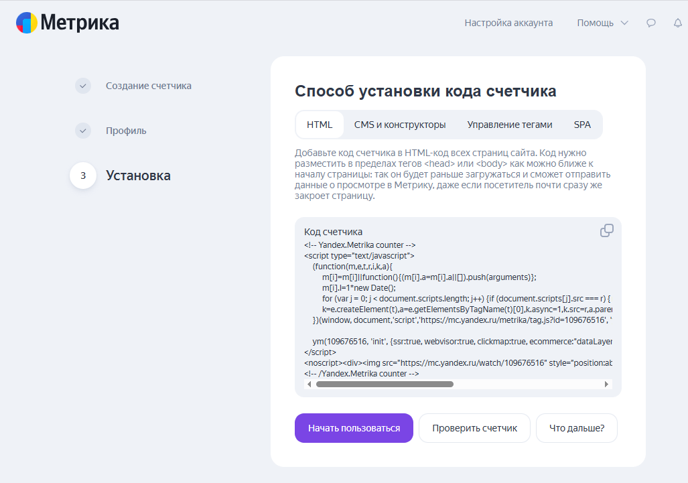
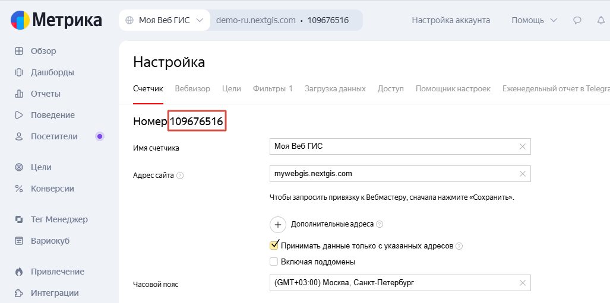

.. _ngcom_ya_metr:

Как подключить свою Веб ГИС к Яндекс.Метрике
============================================

.. note:: 
        Функционал доступен только на плане `Premium <https://nextgis.ru/pricing-base/>`_

Мониторить статистику посещений вашей Веб ГИС можно, подключив её к Яндекс Метрике. Для подключения, необходимо создать счётчик на сайте метрики и добавить его номер в вашу Веб ГИС.

Выполните следующие шаги:

* Откройте страницу `Яндекс Метрики <https://yandex.ru/adv/metrika>`_, нажмите Войти, используйте свой аккаунт на Яндекс и выберите **Создать счётчик**, а потом **Добавить счётчик**:

   Создание нового счётчика

* Впишите название счётчика, URL вашей Веб ГИС и нажмите **Продолжить**.

.. figure:: _static/metr_sett_1.png
   :name: metr_sett_1
   :align: center
   :width: 20cm

   Название счётчика и URL Веб ГИС
   
Шаг заполнения профиля можно пропустить. На шаге выбора способа установки оставьте вариант по умолчанию и нажмите **Начать пользоваться**.

   Завершение создания счётчика

* Скопируйте номер счётчика.

   Номер счётчика в настройках Яндекс Метрики

* Зайдите в свою Веб ГИС, в Панели управления отройте раздел **Метрики и аналитика**. Нажмите **Добавить** и выберите во всплывающем меню "Яндекс Метрика".

.. figure:: _static/metr_add_ru.png
   :name: metr_add_pic
   :align: center
   :width: 20cm

   Добавление Яндекс Метрики в разделе "Метрики и аналитика"

* Вставьте скопированный номер счётчика.

.. figure:: _static/metr_number_paste_ru.png
   :name: metr_number_paste_pic
   :align: center
   :width: 20cm

   Добавление счётчика

* Для завершения операции нажмите **Сохранить**.

Для просмотра аналитики, по мере необходимости заходите на страницу `Яндекс Метрики <https://metrika.yandex.ru/>`_., выбирайте ваш счётчик и работайте с отчетами. 

Подробнее о настройке счётчиков и работе с отчётами можно прочитать в `руководстве пользователя Яндекс Метрики <https://yandex.ru/support/metrica/ru/>`_.