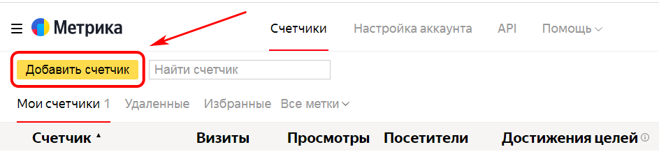
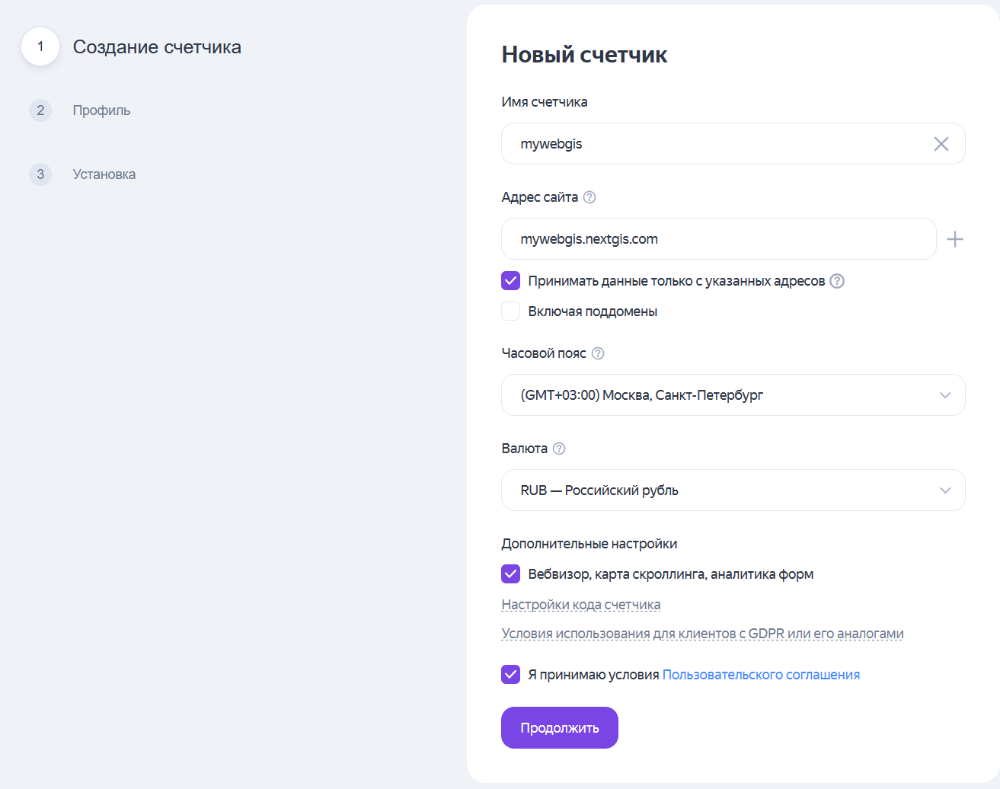
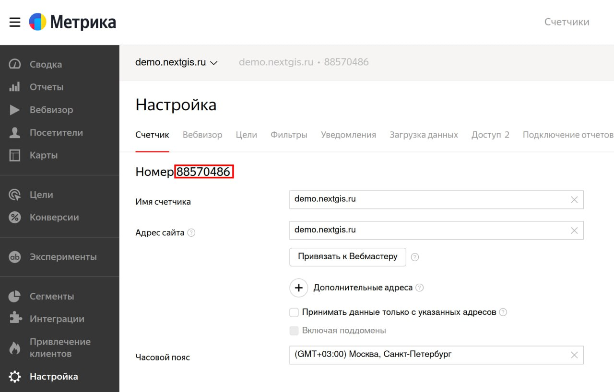
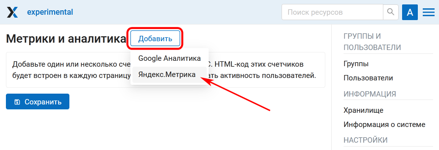
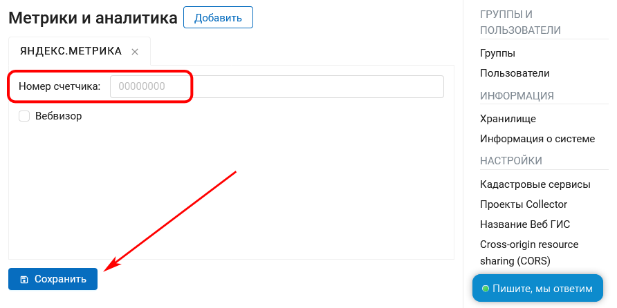

.. _ngcom_ya_metr:

Как подключить свою Веб ГИС к Яндекс.Метрике
============================================

.. note:: 
        Функционал доступен только на плане `Premium <https://nextgis.ru/pricing-base/>`_

Мониторить статистику посещений вашей Веб ГИС можно, подключив её к Яндекс Метрике. Для подключения, необходимо создать счетчик на сайте метрики и добавить его номер в вашу Веб ГИС.

Выполните следующие шаги:

* Откройте страницу `Яндекс Метрики <https://yandex.ru/adv/metrika>`_, нажмите Войти, используйте свой аккаунт на Яндекс и выберите **Создать счетчик**, а потом **Добавить счетчик**:

   Создание нового счетчика

* Впишите название счетчика, URL вашей Веб ГИС и нажмите **Продолжить**.

   Название счетчика и URL Веб ГИС
   
Шаг заполнения профиля можно пропустить.

На шаге установка профиля нажмите **Продолжить**.

* Скопируйте номер счетчика.

   Номер счетчика в настройках Яндекс Метрики

* Зайдите в свою Веб ГИС, в Панели управления отройте раздел **Метрики и аналитика**. Нажмите **Добавить** и выберите во всплывающем меню "Яндекс Метрика".

   Добавление Яндекс Метрики в разделе "Метрики и аналитика"

* Вставьте скопированный номер счетчика.

   Добавление счетчика

* Для завершения операции нажмите **Сохранить**.

Для просмотра аналитики, по мере необходимости заходите на страницу `Яндекс Метрики <https://metrika.yandex.ru/>`_., выбирайте ваш счетчик и работайте с отчетами.